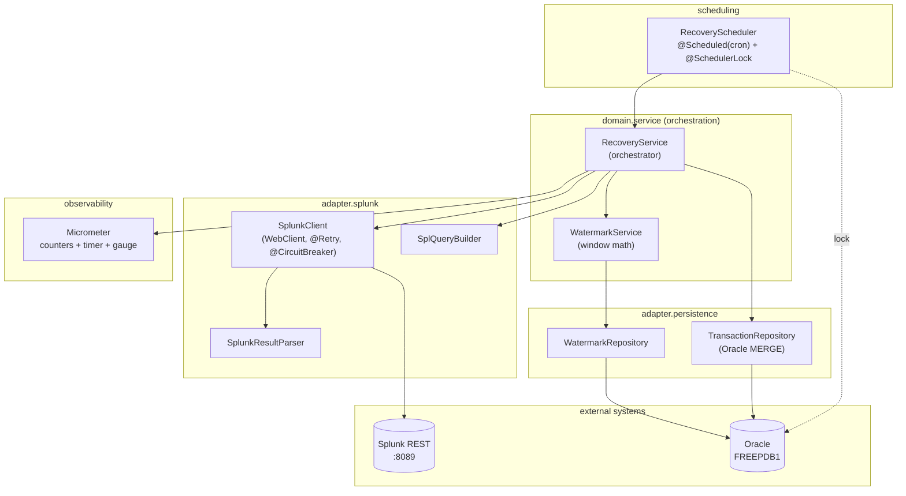
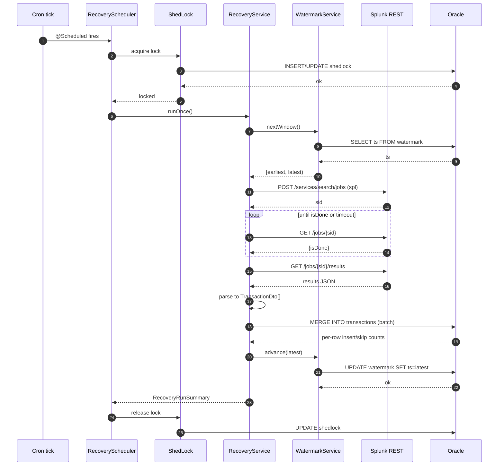
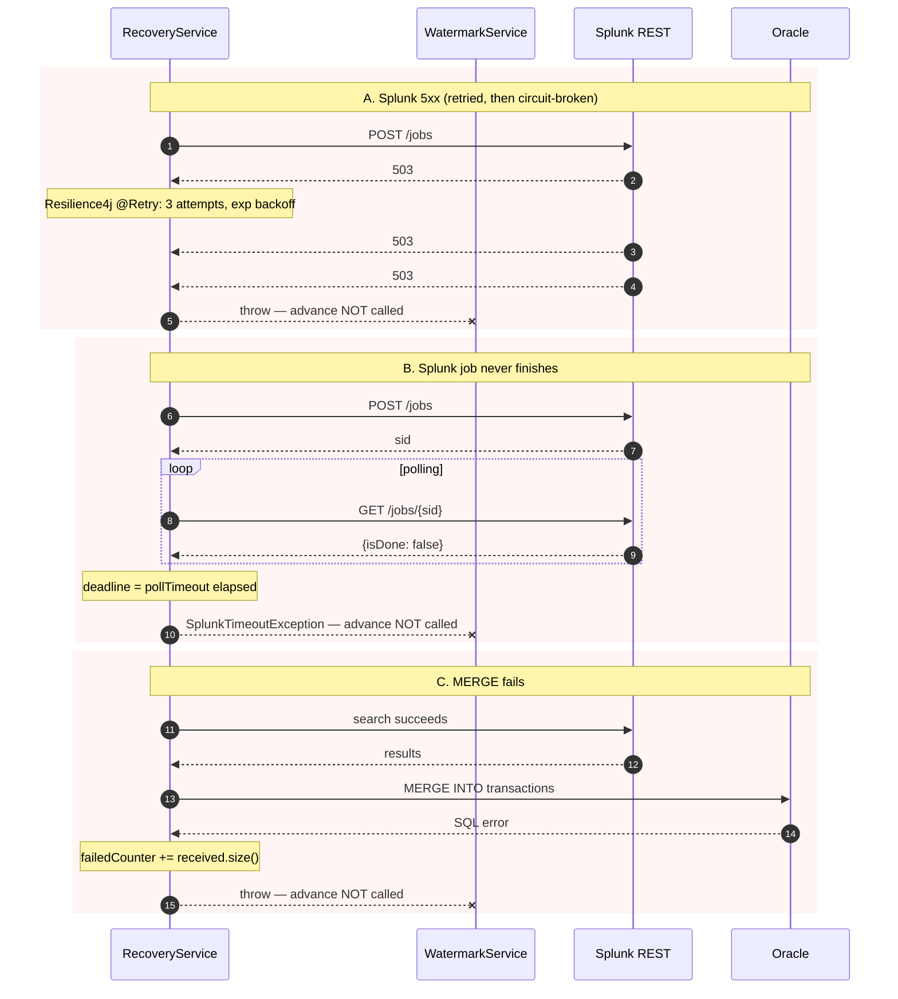

# Code walkthrough

A guided tour of the codebase, layer by layer, with sequence diagrams.
Read this if you want to understand **how** the service does what `design.md`
says it does.

---

## Package layout

```
com.example.txrecovery
├── TxRecoveryApplication.java          # main()
├── config/                             # @Configuration, @ConfigurationProperties
├── domain/
│   ├── model/                          # records — pure data, no Spring
│   └── service/                        # business logic — orchestrator + watermark
├── adapter/
│   ├── splunk/                         # outbound Splunk REST adapter
│   └── persistence/                    # outbound Oracle JDBC adapter
└── scheduling/                         # @Scheduled entry point
```

The intent is hexagonal-ish: **`domain` is the centre**, adapters are
swappable rims. The orchestrator (`domain.service.RecoveryService`) is the
*only* class that knows the full pipeline. Adapters don't know each other
exists — `SplunkClient` has never heard of Oracle and `TransactionRepository`
has never heard of Splunk.

---

## Architecture (component view)



> **Importing to LucidChart:** copy the Mermaid block above and paste into
> *File → Import → Mermaid*. The same source is in
> [`diagrams/architecture.mmd`](diagrams/architecture.mmd).

---

## Bootstrap: `TxRecoveryApplication.java`

```java
@SpringBootApplication
@ConfigurationPropertiesScan
@EnableScheduling
public class TxRecoveryApplication { ... }
```

Three annotations do all the wiring:

| Annotation                       | What it switches on                                              |
| -------------------------------- | ---------------------------------------------------------------- |
| `@SpringBootApplication`         | Auto-config + `@ComponentScan` rooted at this package            |
| `@ConfigurationPropertiesScan`   | Picks up `SplunkProperties` / `RecoveryProperties` records       |
| `@EnableScheduling`              | Lets `@Scheduled` annotations on `RecoveryScheduler` fire        |

No manual `WebApplicationType` is set — we ship `spring-boot-starter-webflux`
so Spring Boot starts a reactive Netty server. Actuator endpoints run on that
same server.

---

## Configuration layer

### `SplunkProperties` & `RecoveryProperties`

Both are immutable **records** with bean-validation constraints:

```java
@Validated
@ConfigurationProperties(prefix = "splunk")
public record SplunkProperties(
    @NotBlank String baseUrl,
    @NotBlank String token,
    @NotNull  Duration pollInterval,
    @NotNull  Duration pollTimeout,
    boolean   trustSelfSigned,
    @NotBlank String splQuery) {}
```

Why records: they're immutable, equality is value-based, and there's no
Lombok magic. The validation annotations run at context-startup so a bad
`application.yml` fails fast with a useful message.

### `ClockConfig`

Exposes a `Clock` bean (`Clock.systemUTC()`). Every service that needs the
current time depends on this bean, which means tests can substitute
`Clock.fixed(...)` for deterministic windows. `WatermarkServiceTest` and
`RecoveryServiceTest` both use this.

### `SplunkClientConfig`

Wires the `WebClient`, the `SplunkClient`, and the `SplQueryBuilder`. The
`trustSelfSigned` branch is one of the two intentional `TODO`s in the
codebase — the local Splunk uses a self-signed cert; production must trust
the cert chain properly.

```java
if (props.trustSelfSigned()) {
    SslContext insecureCtx = SslContextBuilder.forClient()
            .trustManager(InsecureTrustManagerFactory.INSTANCE)
            .build();
    httpClient = httpClient.secure(spec -> spec.sslContext(insecureCtx));
}
```

### `ShedLockConfig`

Wires ShedLock against the `shedlock` table created by Flyway V3.

```java
return new JdbcTemplateLockProvider(
    JdbcTemplateLockProvider.Configuration.builder()
        .withJdbcTemplate(new JdbcTemplate(dataSource))
        .withTableName("shedlock")
        .usingDbTime()  // DB owns the clock — no app-instance skew
        .build());
```

`usingDbTime()` matters: lock TTL is enforced by the DB's `SYSTIMESTAMP`,
so two app instances with skewed clocks can't both claim the lock.

### `ObservabilityConfig`

Registers all six Micrometer instruments referenced in `design.md`. The
`watermark.lag.seconds` is a *gauge* — Micrometer calls
`WatermarkLagGauge.lagSeconds()` whenever a scraper hits
`/actuator/prometheus`, so the value is always fresh.

---

## Domain layer

### Model records

All immutable, all free of Spring annotations:

| record                  | meaning                                                          |
| ----------------------- | ---------------------------------------------------------------- |
| `TransactionDto`        | Placeholder — replace with your real transaction shape           |
| `Watermark`             | `(name, timestamp)` pair from the watermark table                |
| `TimeWindow`            | Half-open `[earliest, latest)` with `earliest < latest` invariant |
| `RecoveryRunSummary`    | Outcome of one orchestration run (counts, elapsed, advanced)     |

### `WatermarkService.nextWindow()`

```java
public TimeWindow nextWindow() {
    Instant watermark = repo.find(SPLUNK).map(Watermark::timestamp).orElse(EPOCH);
    Instant earliest = watermark.minus(props.overlapWindow());
    if (earliest.isBefore(EPOCH)) earliest = EPOCH;        // (a)
    Instant latest = clock.instant();
    if (!earliest.isBefore(latest)) earliest = latest.minusMillis(1);  // (b)
    return new TimeWindow(earliest, latest);
}
```

Two guards worth highlighting:

- **(a)** The seed watermark is `EPOCH`. With a 5-min overlap, naive
  subtraction underflows to `1969-12-31T23:55:00Z`. Splunk rejects pre-1970
  values in inline time modifiers — clamping at `EPOCH` is essential.
- **(b)** Clock-skew safety. If something has set the watermark in the
  future, we still return a valid window rather than throwing — the
  orchestrator decides what to do.

### `WatermarkService.advance()`

```java
public void advance(Instant to) {
    repo.update(WatermarkRepository.SPLUNK, to);
}
```

Trivially small — but the caller (`RecoveryService`) treats this as a
critical step: it's the *only* call site that mutates the watermark, and it
runs **only after MERGE succeeds**.

### `RecoveryService.runOnce()` — the orchestrator

The pipeline reads top to bottom:

```java
String runId = UUID.randomUUID().toString();
TimeWindow window = watermarkService.nextWindow();        // 1. read window
Instant watermarkBefore = watermarkService.current();

MDC.put("runId", runId);
MDC.put("windowStart", window.earliest().toString());
MDC.put("windowEnd", window.latest().toString());

try {
    String spl = queryBuilder.build(window.earliest(), window.latest());  // 2. render SPL

    List<TransactionDto> received =                                       // 3. run search
        splunkSearchTimer.record(() -> splunkClient.runSearch(spl));
    splunkResultsCounter.increment(received.size());

    InsertCounts counts;
    try {
        counts = transactionRepository.merge(received);                   // 4. MERGE
    } catch (RuntimeException e) {
        failedCounter.increment(received.size());
        throw e;  // watermark NOT advanced
    }
    insertedCounter.increment(counts.inserted());
    skippedCounter.increment(counts.skippedDuplicate());

    watermarkService.advance(window.latest());                            // 5. advance ONLY on success
    log.info("recovery-run runId={} window=[{}..{}) ...", ...);
    return summary;
} finally {
    MDC.clear();
}
```

The contract: any exception thrown before step 5 means the watermark stays
where it was. The next scheduled run re-reads the same window. The
`@Tag("integration")` test `RecoveryPipelineIT` proves this for both Splunk
and DB failures.

---

## Splunk adapter

### `SplQueryBuilder` — placeholder substitution

```java
public String build(Instant earliest, Instant latest) {
    return template
        .replace("${earliest}", Long.toString(earliest.getEpochSecond()))
        .replace("${latest}",   Long.toString(latest.getEpochSecond()));
}
```

The format choice (epoch seconds) is deliberate: Splunk's inline
`earliest=`/`latest=` modifiers accept three formats — epoch seconds,
relative time (`-7d`), or quoted strings with explicit `timeformat`.
ISO-8601 (`2026-06-07T...Z`) is **not** valid here; using it causes Splunk
to parse-fail the search, mark the job done-with-error, and return 400 on
`/results`. Epoch seconds work always.

### `SplunkClient.runSearch()` — the search lifecycle

```java
@CircuitBreaker(name = "splunk")
@io.github.resilience4j.retry.annotation.Retry(name = "splunk")
public List<TransactionDto> runSearch(String spl) {
    String sid = createJob(spl).block(props.pollTimeout());      // POST  /services/search/jobs
    waitForCompletion(sid).block(props.pollTimeout());           // GET   /jobs/{sid}        (loop)
    SplunkResultsResponse r = fetchResults(sid).block(...);      // GET   /jobs/{sid}/results
    return SplunkResultParser.parse(r.results());
}
```

Three Splunk calls in series; `block()` collapses them to a synchronous API
the orchestrator can call from a regular `@Scheduled` thread. The two
annotations layer Resilience4j retry (exponential backoff, max 3) and the
circuit breaker (count-based window of 20) around the whole call.

### `SplunkClient.waitForCompletion()` — the reactive poll loop

```java
return pollStatus(sid)
    .flatMap(status -> {
        if (status.isDone()) return Mono.empty();
        if (Instant.now().isAfter(deadline))
            return Mono.error(new SplunkTimeoutException(...));
        return Mono.error(new RetrySignal());
    })
    .retryWhen(Retry.fixedDelay(Long.MAX_VALUE, props.pollInterval())
        .filter(t -> t instanceof RetrySignal))
    .then();
```

`RetrySignal` is an internal marker. The Reactor `retryWhen` retries on
`RetrySignal` (re-poll) but not on `SplunkTimeoutException` (propagates to
the orchestrator and aborts the run). This is **polling cadence**, not
failure retry — failure retry is the `@Retry` annotation on `runSearch`.

### `SplunkResultParser` — defensive parsing

- Skips rows with missing/blank `id` (returns a smaller list rather than
  throwing — a single bad row should not abort the batch).
- Accepts `_time` as ISO-offset string or as a numeric epoch.
- Accepts `amount` as `Number` or as a String.

This is the *only* place that knows the wire shape of Splunk's response.
If you replace `TransactionDto`, edit this file in the same commit.

---

## Persistence adapter

### `TransactionRepository.merge()` — Oracle's MERGE

```sql
MERGE INTO transactions t
USING (SELECT :id AS id, :ts AS ts, :amount AS amount,
              :status AS status, :raw_payload AS raw_payload
         FROM dual) src
  ON (t.id = src.id)
WHEN NOT MATCHED THEN
  INSERT (id, ts, amount, status, raw_payload)
  VALUES (src.id, src.ts, src.amount, src.status, src.raw_payload)
```

No `WHEN MATCHED` clause → duplicates are silently absorbed. The natural
key (`id`) is the dedup gate. `batchUpdate` returns one row count per row:
`1` = inserted, `0` = duplicate skipped.

Why not `INSERT ... ON CONFLICT`? PostgreSQL syntax, doesn't exist in
Oracle. Why not `INSERT + catch DuplicateKeyException`? One round-trip per
row plus an exception per duplicate; on a 1000-row batch with overlapping
events that's 5x slower than MERGE.

### `WatermarkRepository`

Just a `find` + `update`. The seed row (`name='splunk', ts=epoch`) is
inserted by Flyway V2 so there's never a "row missing" path to handle
beyond the explicit `IllegalStateException` guard.

---

## Scheduling layer

### `RecoveryScheduler`

```java
@Scheduled(cron = "${recovery.schedule-cron}")
@SchedulerLock(
    name = "RecoveryScheduler_run",
    lockAtMostFor = "${recovery.lock-at-most-for}",
    lockAtLeastFor = "PT0S")
public void run() {
    try {
        recoveryService.runOnce();
    } catch (RuntimeException e) {
        log.debug("recovery-run threw; suppressed at scheduler boundary", e);
    }
}
```

- `@Scheduled(cron = "${...}")` — Spring resolves the placeholder at
  startup; you can change cadence with `RECOVERY_SCHEDULE_CRON=0 */1 * * * *`
  without recompiling.
- `@SchedulerLock` — ShedLock wraps the method; only one app instance
  globally runs `run()` per cron tick.
- Catch + suppress — the *underlying* `RecoveryService.runOnce()` already
  logged at WARN. We swallow at this boundary so a single failure doesn't
  kill the `@Scheduled` thread for the rest of the process's lifetime.

---

## Sequence diagrams

### Happy path



Source: [`diagrams/sequence-happy.mmd`](diagrams/sequence-happy.mmd).

### Failure paths



In every failure case, the watermark stays at its previous value. The next
cron tick re-reads the same `[earliest, latest)`. Combined with MERGE-based
dedup, this is the **at-least-once read / exactly-once write** guarantee
the service makes.

Source: [`diagrams/sequence-failure.mmd`](diagrams/sequence-failure.mmd).

---

## Error-handling matrix

| failure                              | thrown by                       | metric incremented | watermark advances? |
| ------------------------------------ | ------------------------------- | ------------------ | ------------------- |
| Splunk 5xx / network                 | `WebClientResponseException`    | `splunk.search.*`  | no                  |
| Splunk job parse-error               | 400 on `/results`               | `splunk.search.*`  | no                  |
| Splunk polling exceeds `poll-timeout`| `SplunkTimeoutException`        | `splunk.search.*`  | no                  |
| Circuit breaker OPEN                 | `CallNotPermittedException`     | (Resilience4j tags)| no                  |
| `MERGE` SQL error                    | `DataAccessException`           | `transactions.failed += received.size()` | no |
| Empty result set                     | (no error)                      | `splunk.search.results.count += 0` | **yes** — quiet periods still advance |
| `WatermarkService.advance` fails     | `IllegalStateException`         | none specific      | no (effectively)    |

The "quiet periods still advance" row is the one most likely to surprise:
if Splunk returns zero rows for the window, we still advance the watermark
so that the next run's `[earliest - overlap, now)` doesn't grow without
bound.

---

## Observability ↔ code map

| Where                              | What it produces                                         |
| ---------------------------------- | -------------------------------------------------------- |
| `RecoveryService.runOnce` (timer)  | `splunk.search.duration` histogram                       |
| `RecoveryService.runOnce` (counters)| `splunk.search.results.count`, `transactions.inserted`, `transactions.skipped`, `transactions.failed` |
| `ObservabilityConfig.WatermarkLagGauge` | `watermark.lag.seconds` gauge (computed on scrape)  |
| `RecoveryService` MDC              | `runId`, `windowStart`, `windowEnd` (JSON-log enrichment) |
| `RecoveryService` INFO log         | One-line summary per successful run                      |
| `RecoveryService` WARN log         | One-line summary per failed run                          |

---

## Where to extend next

- **Replace `TransactionDto` with the real schema:** edit four files in
  one commit — the record, `SplunkResultParser`, `TransactionRepository`'s
  MERGE statement, and `V1__create_transactions.sql`.
- **Add a second source (e.g. "datadog"):** `WatermarkRepository` already
  keys by `name`. You'd add a new `RecoveryService` instance with a
  different bean qualifier and a parallel `@Scheduled` method — each with
  its own ShedLock name.
- **Tighten retry policy per Splunk endpoint:** split `runSearch` into
  three annotated methods, each with its own retry config.
- **Switch to push (HEC) for transactions:** kill the SPL search lifecycle
  entirely and accept HEC posts. Both the watermark and MERGE stay; only
  the Splunk adapter changes.

See [`design.md`](design.md) for the explicit out-of-scope list.
