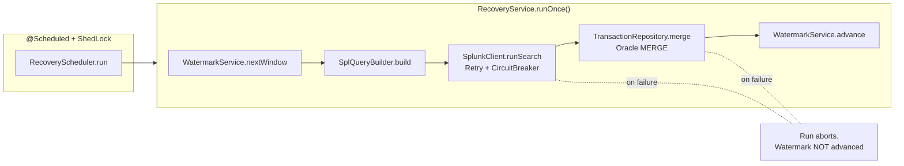

# Design

## Goals

A Spring Boot service that periodically copies transaction events from Splunk
into Oracle with two strict guarantees:

1. **No data loss** — every event in Splunk that matches the SPL query
   eventually lands in Oracle.
2. **No double-write** — duplicate events are silently absorbed by the database
   layer; an operator never sees the same `id` twice.

Throughput is a secondary concern. Operability (clear runbook, observable
state, resumable on failure) is the primary one.

## Pipeline



Adapters know nothing about each other; the orchestrator is the only class that
holds the whole pipeline. This makes the Splunk adapter and the persistence
adapter independently testable and swappable.

## Watermark semantics

The watermark is the timestamp of the last successfully processed Splunk event
window. It is stored in a single row of the `watermark` table.

Each run reads the half-open interval `[watermark − overlap, now)`:

- **Subtracting `overlap`** (default 5 min) re-reads the tail of the previous
  window. This catches events that arrived in Splunk after the previous run
  completed but with timestamps inside the previous window — late-arriving
  logs are common in any indexing pipeline.
- **Duplicates** caused by overlap are filtered at the DB layer (Oracle MERGE),
  not by the query. This decouples correctness from query semantics.
- **Advance on success only.** The watermark moves only after MERGE succeeds.
  Any failure (Splunk error, parser error, DB error) aborts the run; the next
  run re-reads the same window.
- **Wall-clock latest, not max(event-ts).** We advance to the window's `latest`
  (sampled at the start of the run), not the maximum event timestamp in the
  batch. An empty batch still advances the watermark — otherwise a quiet
  period would cause an unbounded re-read window.

This gives **at-least-once** semantics for Splunk reads and, combined with
MERGE-based dedup on the `id` column, **exactly-once** semantics for Oracle
writes.

## Deduplication — why Oracle MERGE

The `transactions` table has `PRIMARY KEY (id)`. Inserts use Oracle's
single-row MERGE:

```sql
MERGE INTO transactions t
USING (SELECT :id AS id, :ts AS ts, ... FROM dual) src
  ON (t.id = src.id)
WHEN NOT MATCHED THEN
  INSERT (id, ts, ...) VALUES (src.id, src.ts, ...);
```

There is no `WHEN MATCHED` clause — duplicates are absorbed silently.

**Why MERGE over alternatives:**

- **`INSERT ... ON CONFLICT`** is PostgreSQL syntax. Oracle does not support
  it. Using it would silently break the integration.
- **`INSERT` per row + catch `DuplicateKeyException`** works but costs one
  round-trip per row and one exception per duplicate. With `batch-size: 1000`
  and an overlap window full of duplicates, this is the difference between
  ~50ms and ~5s per batch.
- **`INSERT IGNORE` / `INSERT ... LOG ERRORS`** require extra setup (an error
  table) and obscure the row-count signal we use for metrics.

MERGE is also the documented Oracle pattern, so future maintainers won't be
surprised.

## Resilience

- **Retry** on `SplunkClient.runSearch`: exponential backoff, max 3 attempts,
  retries on `WebClientResponseException`, `IOException`, `TimeoutException`.
- **Circuit breaker** on `SplunkClient.runSearch`: count-based window of 20
  calls, opens at 50% failure rate, 30s open state, 3 half-open probes.
- **Poll timeout** (default 60s) caps how long we wait for a single Splunk
  search job to finish.
- **ShedLock** (lock-at-most-for default 10m) prevents two instances of the
  app from running the job in parallel.

Any Splunk failure causes `RecoveryService.runOnce` to throw, which aborts the
run *before* the watermark is advanced — there is no path where data is
considered persisted but missing.

## Observability

`/actuator/prometheus` exposes:

| metric                          | type    | meaning                                          |
| ------------------------------- | ------- | ------------------------------------------------ |
| `splunk.search.duration`        | timer   | wall time per `runSearch` call                   |
| `splunk.search.results.count`   | counter | rows received from Splunk                        |
| `transactions.inserted`         | counter | rows actually inserted (MERGE matched 0 rows)    |
| `transactions.skipped`          | counter | duplicates absorbed by MERGE                     |
| `transactions.failed`           | counter | rows lost to a persistence error                 |
| `watermark.lag.seconds`         | gauge   | `now − currentWatermark` — alert on this         |

Plus every per-run INFO log line includes:

```
recovery-run runId=... window=[start..end) received=N inserted=N skipped_duplicate=N failed=N elapsed_ms=N watermark_advanced_to=...
```

with `runId`, `windowStart`, `windowEnd` also propagated through SLF4J MDC for
JSON log enrichment.

## Out of scope

- **Backfill UI / API.** The runbook describes how to manually reset the
  watermark; an HTTP endpoint to do so is not provided. (We do not want anyone
  resetting the watermark by accident.)
- **Schema evolution of `transactions`.** `TransactionDto` is a placeholder.
  Replacing it requires a coordinated Flyway migration and a code change — the
  service will not auto-migrate to a new schema.
- **Splunk search rewriting.** The SPL query is taken verbatim from
  configuration and the only substitutions are the `${earliest}`/`${latest}`
  placeholders. We do not parse, validate, or sanitize the SPL beyond that.
- **Multi-source watermarking.** The `watermark` table is keyed by `name` but
  the code only uses the `splunk` row. Adding a second source would require a
  second orchestrator and is intentionally not abstracted now.
- **Replay / re-processing.** If a downstream consumer of `transactions` wants
  a row re-delivered after MERGE silently skipped it, this service cannot help
  — by design, MERGE never updates existing rows.
- **TLS hardening in dev.** The `splunk.trust-self-signed` flag is dev-only
  and must be `false` in any non-dev environment.
